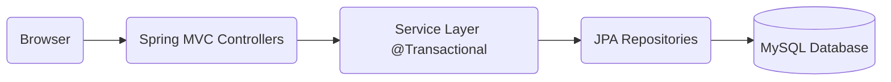

<div align="center">

# 🏢 eDomoupravitel (Electronic Condominium Manager)


**eDomoupravitel** is a modern, web-based **B2B SaaS (Software as a Service)** system designed for comprehensive condominium management. Its primary goal is to automate and streamline administrative processes for professional property managers.
The system provides an end-to-end solution for managing buildings, apartments, residents, finances, and employees, wrapped in an intuitive, contemporary user interface with a strong focus on data integrity and security.

</div>

---

## 🛠 Tech Stack

The project is built upon a robust, multi-tier architecture using the latest Java technologies:
| Category | Technologies |
| :--- | :--- |
| **Backend** | Java 21, Spring Boot 4 (Spring MVC, Spring Data JPA) |
| **Database** | MySQL 8.0 CE, Hibernate ORM |
| **Frontend** | Thymeleaf, Bootstrap 5, JavaScript |
| **Build & Tools** | Gradle, Lombok, Spring Boot DevTools |
| **Testing** | JUnit 5, Mockito |

---

## 📐 Architecture & Design
The system adheres to a strict **Separation of Concerns (SoC)** principle, ensuring maintainability and scalability:



---

## 🗄️ Database Schema

The project utilizes a relational database with a normalized structure to ensure data consistency.


## Core Еntities:

1. **Company:** A professional property management firm.
2. **Building:** A residential building managed by a specific company.
3. **Employee:** A staff member responsible for building maintenance.
4. **Apartment:** The primary unit within a building.
5. **Resident:** An occupant of an apartment (tracks attributes like age and elevator usage).
6. **Owner:** The legal owner of the property (can differ from the resident).
7. **Payment:** A record of a financial transaction.
8. **MonthlyFee:** Nomenclature/Definitions for recurring monthly fees.

---

## ⚙️ Features & Business Logic

### 1. Company & Building Management (CRUD)
* **Companies:** Full capability to create, edit, and offboard maintenance firms.
* **Buildings:** A registry of buildings with details such as address, number of floors, total apartments, and built-up area.
* **Apartments:** Granular management of units, including floor number, square footage, and occupancy status.
* **Validation:** Robust protection against invalid data entry (e.g., negative values for area or floors).

### 2. Smart Resident Management
The system distinguishes between **Legal Owners** and **Residents**.
* **Age Validation:** Automatic tracking of resident age. Children under 7 years old are flagged in the system and are exempt from specific taxes.
* **Elevator Logic:** Individual settings for each resident regarding elevator usage (flag `usesElevator`), affecting the final monthly fee.

### 3. Employee Load Balancing
* **Staffing:** Hiring and releasing personnel.
* **Auto-Assignment Algorithm:**
   * When a **new building** is added, it is automatically assigned to the employee with the **lowest current workload**.
   * When an **employee is removed**, their assigned buildings are automatically redistributed among the remaining active colleagues.
 
### 4. Finances & Billing Engine
The system employs an intelligent algorithm for calculating monthly fees:
* **Fee Calculation Logic:**
    * Base fee calculated by **Square Footage** (m²).
    * Additional fee for every resident **over 7 years old** using the elevator.
    * Surcharges for **pets**.
* **Scheduler:** Automatic accrual of monthly obligations for all apartments (triggered on the 5th of every month).

### 5. Reporting & Analytics
Built-in tools for data analysis and transparency:
* **Smart Payments (FIFO)**: A payment module that automatically covers the oldest outstanding debts first when a lump sum is paid.
* **Filtering & Sorting:**
    * Sort Companies by total revenue.
    * Sort Employees by name or workload (number of buildings).
    * Sort Residents by name or age.
* **Detailed Reports:**
    * Building rosters (Apartments & Residents).
    * Treasury Reports (Due vs. Paid amounts).


### 6. Data Export
* **CSV Export:** Generate comprehensive reports of all transactions, including:
    * Company, Employee, Building, Unit details, Amount, and Timestamp.

---

## 🖥️ UI/UX Highlights

The interface is designed to provide a "Single Page Application" feel using server-side rendering:

* **Interactive Modals:** All major operations (Create, Edit, Delete, Pay) occur within modal windows, preventing unnecessary page reloads.
* **Dashboard Widgets:** Animated counters and real-time statistics.
* **Visual Hierarchy:** Extensive use of `Badges`, `Icons`, and `Cards` for quick information scanning.

---

## 🚀 Installation & Setup

1.  **Clone the repository:**
    ```bash
    git clone https://github.com/your-username/eDomoupravitel.git
    ```
2.  **Configure the Database:**
    Open `src/main/resources/application.properties` and set your MySQL credentials:
    ```properties
    spring.datasource.url=jdbc:mysql://localhost:3306/edomoupravitel_db?createDatabaseIfNotExist=true
    spring.datasource.username=root
    spring.datasource.password=admin
    spring.jpa.hibernate.ddl-auto=update
    ```
3.  Build and Run:
* **Via IntelliJ IDEA:** Run `EDomoupravitelApplication.java`
* **Via Terminal:**
  ```properties
  ./gradlew bootRun
  ```
4.  **Access the Application:** Open your browser and navigate to: `http://localhost:8080`

---
