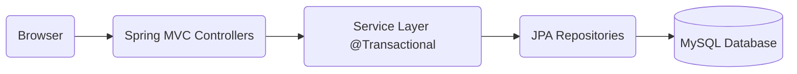

# 🏢 eDomoupravitel (Electronic Condominium Manager)


**eDomoupravitel** е модерна уеб-базирана **B2B SaaS (Software as a Service)** система за управление на етажна собственост. Целта ѝ е да автоматизира и улесни административните процеси на професионалните домоуправители.
Системата предоставя цялостно решение за мениджмънт на сгради, апартаменти, живущи, финанси и служители, обвито в интуитивен и съвременен потребителски интерфейс с фокус върху сигурността на данните.

---

## 🛠 Tech Stack

Проектът е изграден върху стабилна многослойна архитектура:

| Категория | Технологии |
| :--- | :--- |
| **Backend** | Java 21, Spring Boot 4 (Spring MVC, Spring Data JPA) |
| **Database** | MySQL 8.0 CE, Hibernate ORM |
| **Frontend** | Thymeleaf, Bootstrap 5, JavaScript |
| **Build & Tools** | Gradle, Lombok, Spring Boot DevTools |
| **Testing** | JUnit 5, Mockito |

---

## 📐 Архитектура и дизайн

Системата следва стриктно разделение на отговорностите (Separation of Concerns):



---

## 🗄️ Database Schema

Проектът използва релационна база данни с нормализирана структура за съхранение на данните.


### Основни Еntities:
1.  **Company:** Фирма за домоуправление.
2.  **Building:** Сграда, управлявана от конкретна фирма.
3.  **Employee:** Служител, отговарящ за поддръжката на сгради.
4.  **Apartment:** Основна единица в сградата.
5.  **Resident:** Живущ в апартамент (с атрибути за възраст и ползване на асансьор).
6.  **Owner:** Собственик на имот (може да е различен от живущия).
7.  **Payment:** Запис за извършено плащане.
8.  **MonthlyFee:** Номенклатура за месечни такси.

---

## ⚙️ Функционалности и бизнес логика

### 1. Управление на компании и сгради (CRUD)
* **Компании:** Пълна функционалност за създаване, редакция и изтриване на фирми за поддръжка.
* **Сгради:** Регистър на сгради с детайли: адрес, етажност, брой апартаменти и застроена площ.
* **Апартаменти:** Детайлно управление на апартаменти, включително етаж, квадратура и статус.
* **Валидация:** Защита срещу въвеждане на невалидни данни (напр. отрицателни стойности).

### 2. Живущи и Собственици (Smart Resident Management)
Системата прави разлика между собственик и живущ.
* **Валидация на възраст:** Системата автоматично следи възрастта. Деца под 7 години се отбелязват, но не се таксуват.
* **Собственици:** Възможност за отбелязване на собственик.
* **Живущи:** Детайлен профил с име и възраст и възможност за индивидуална настройка за ползване на асансьор (флаг `usesElevator`)

### 3. Служители
* **Служители:** Назначаване и освобождаване на персонал.
* **Автоматично разпределение (Load Balancing):**
    * При добавяне на **нова сграда**, тя автоматично се зачислява на служителя с **най-малко** текущи сгради.
    * При **изтриване на служител**, неговите сгради се преразпределят автоматично към останалите колеги.
 
### 4. Финанси и Такси
Системата използва интелигентен алгоритъм за месечните такси:
* **Калкулация:**
    * Базова такса спрямо **квадратурата** (m²).
    * Всеки живущ **над 7 години**, който ползва асансьор.
    * Наличие на **домашен любимец**.
* **Плащания:** Въвеждане на такси и погасяване на задължения (със запис на дата и сума).
* **Scheduler:** Автоматично начисляване на месечни задължения за всички апартаменти с краен срок за плащане 5-то число

### 5. Справки и Сортиране
Вградени инструменти за анализ на данните:
* **Smart Payments:** Модул за плащания с алгоритъм за автоматично покриване на най-старите задължения (FIFO принцип)
* **Филтриране и Сортиране:**
    * Компании по приход (събрани такси).
    * Служители по име и натовареност (брой сгради).
    * Живущи по име и възраст.
* **Детайлни Справки:**
    * Списък с апартаменти и живущи за всяка сграда.
    * Обобщена информация за дължими vs. платени суми (Treasury Report).


### 6. Експорт на данни
* **CSV Export:** Всички извършени плащания могат да бъдат записани във файл, съдържащ:
    * Фирма, Служител, Сграда, Етаж, Апартамент, Сума и Дата на плащане.

---

## 🖥️ Потребителски интерфейс (UI/UX)

Проектът разполага с напълно преработен, модерен интерфейс:

* **Интерактивни модали:** Всички операции (Create, Edit, Delete, Pay) се случват в модални прозорци без презареждане на страницата.
* **Dashboard Widgets:** Анимирани броячи и статистики в реално време.
* **Визуална йерархия:** Използване на `Badges`, `Icons` и `Cards` за лесно сканиране на информацията.

---

## 🚀 Инсталация и Стартиране

1.  **Клониране на репозиторито:**
    ```bash
    git clone https://github.com/your-username/eDomoupravitel.git
    ```
2.  **Настройка на базата данни:**
    Отворете `src/main/resources/application.properties` и настройте връзката към MySQL:
    ```properties
    spring.datasource.url=jdbc:mysql://localhost:3306/edomoupravitel_db?createDatabaseIfNotExist=true
    spring.datasource.username=root
    spring.datasource.password=admin
    spring.jpa.hibernate.ddl-auto=update
    ```
3.  **Стартиране:**
    * Чрез IntelliJ IDEA: Run `EDomoupravitelApplication.java`
    * Чрез терминал: `./gradlew bootRun`
4.  **Достъп:**
    Отворете браузър на адрес: `http://localhost:8080`

---
